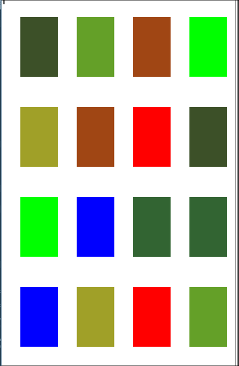
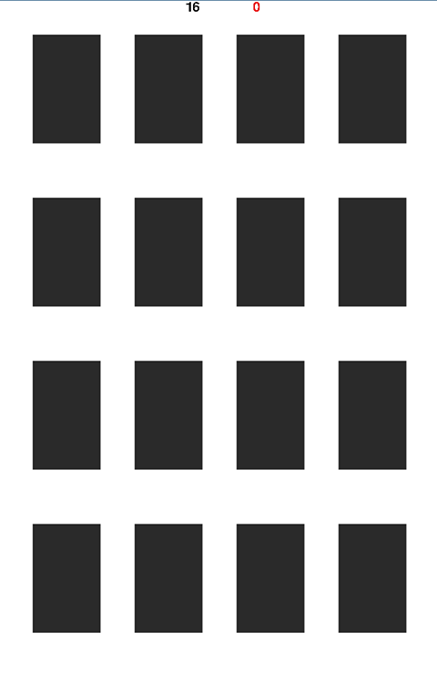
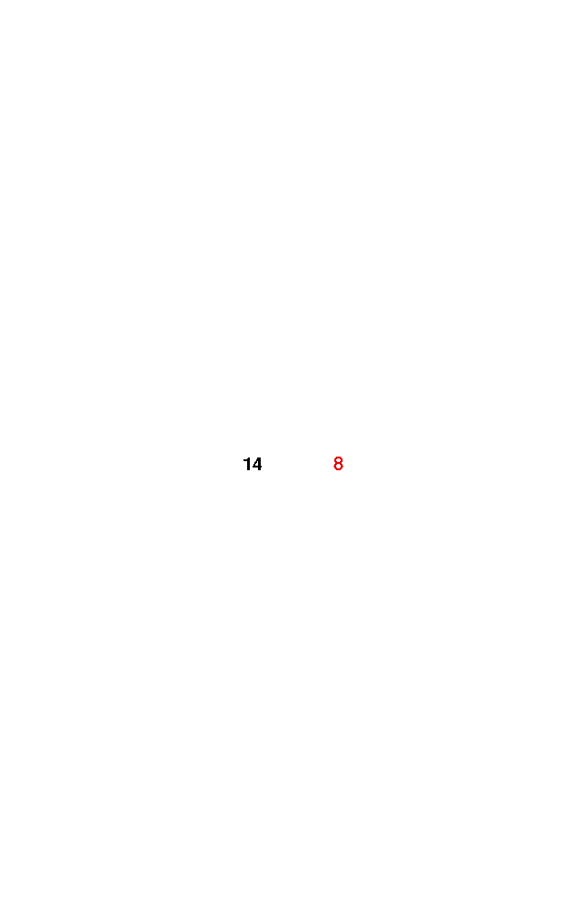

# Memory 
Memory je igrica u kojoj se testira sposobnost igrača da u što kraćem vremenu i sa što manje pogrešaka pronađe par za svaku karticu.

Za napraiti:
- Ljestvica poretka

Napravljeno:
- Kartice prije početka

- Kartice nakon početka

- Rezultat

